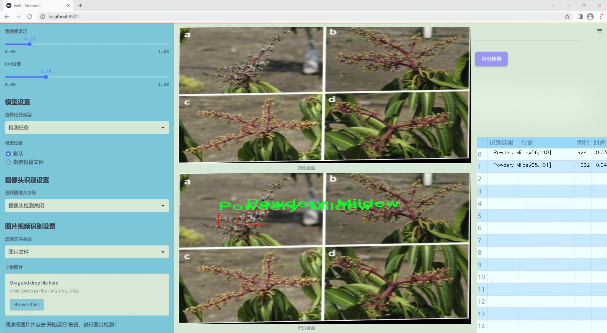
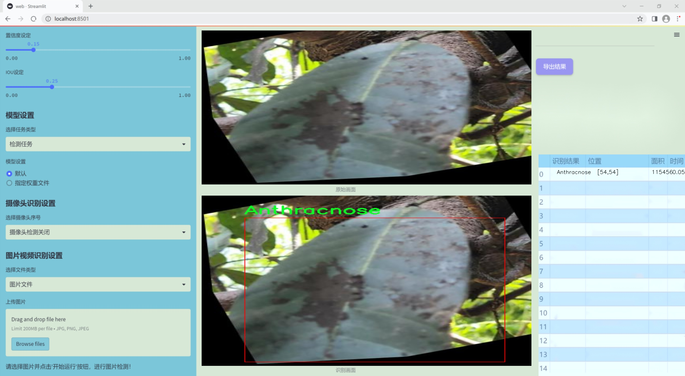
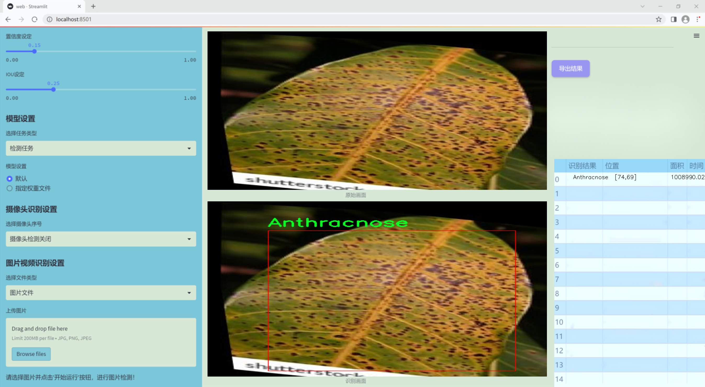
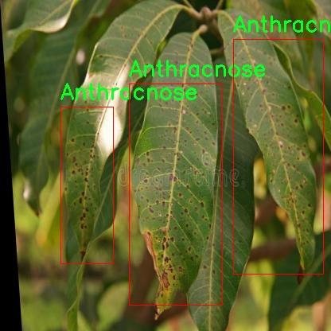
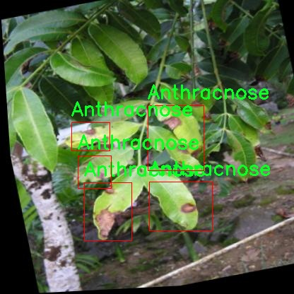
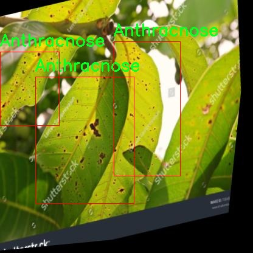
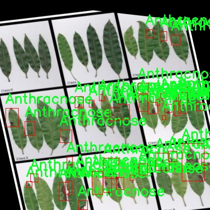

### 1.背景意义

研究背景与意义

随着全球气候变化和农业生产方式的转变，农作物病害的发生频率逐渐增加，尤其是在热带和亚热带地区，芒果作为一种重要的经济作物，其病害问题日益严重。芒果植株常见的病害包括炭疽病、白粉病和尖端枯萎病等，这些病害不仅影响了芒果的产量和品质，还对农民的经济收入造成了显著影响。因此，及时、准确地检测和识别芒果植株的病害，成为了保障农业生产和提高农民收入的重要任务。

传统的病害检测方法主要依赖于人工观察和经验判断，这种方法不仅耗时耗力，而且容易受到主观因素的影响，导致漏检和误判的情况。近年来，随着计算机视觉和深度学习技术的快速发展，基于图像识别的病害检测系统逐渐成为研究的热点。YOLO（You Only Look Once）系列算法因其高效的实时检测能力，已被广泛应用于各类物体检测任务中。特别是YOLOv11的改进版本，具备更强的特征提取能力和更高的检测精度，为芒果植株病害的自动化检测提供了新的技术支持。

本研究旨在基于改进的YOLOv11算法，构建一个高效的芒果植株病害检测系统。我们将利用一个包含417张标注图像的数据集，涵盖了三种主要病害类型：炭疽病、白粉病和尖端枯萎病。通过对数据集的预处理和增强，提升模型的泛化能力和检测准确率，从而实现对芒果植株病害的快速识别和分类。这一系统的开发不仅有助于提高芒果种植的管理效率，还能为农民提供科学的决策支持，最终推动可持续农业的发展。

### 2.视频效果

[2.1 视频效果](https://www.bilibili.com/video/BV1khSMYtEYz/)

### 3.图片效果







##### [项目涉及的源码数据来源链接](https://kdocs.cn/l/cszuIiCKVNis)**

注意：本项目提供训练的数据集和训练教程,由于版本持续更新,暂不提供权重文件（best.pt）,请按照6.训练教程进行训练后实现上图演示的效果。

### 4.数据集信息

##### 4.1 本项目数据集类别数＆类别名

nc: 3
names: ['Anthracnose', 'Powdery Mildew', 'Tipburn']


该项目为【目标检测】数据集，请在【训练教程和Web端加载模型教程（第三步）】这一步的时候按照【目标检测】部分的教程来训练

##### 4.2 本项目数据集信息介绍

本项目数据集信息介绍

本项目所使用的数据集旨在支持改进YOLOv11模型在芒果植株病害检测系统中的应用，特别关注于芒果及其相关植物的病害识别。数据集的主题为“Plant Diagnosis 5 - Mango and Family-”，涵盖了与芒果植株健康状况密切相关的三种主要病害类型。这三种病害分别是“Anthracnose”（炭疽病）、“Powdery Mildew”（白粉病）和“Tipburn”（尖枯病），它们对芒果的生长和产量造成了显著影响。

在数据集构建过程中，研究团队精心收集了大量的样本图像，确保每种病害都有足够的代表性，以便模型能够有效学习并识别不同病害的特征。每个类别的图像均经过标注，确保在训练过程中，模型能够准确地学习到不同病害的视觉特征和表现形式。通过多样化的样本来源，包括不同生长阶段和环境条件下的芒果植株，数据集的多样性进一步增强了模型的泛化能力。

此外，数据集的设计还考虑到了实际应用中的挑战，例如不同光照条件、角度和背景对病害识别的影响。通过这些精心挑选和处理的图像，改进后的YOLOv11模型将能够在实际场景中更准确地检测和分类芒果植株的病害，从而为农民和农业专家提供及时的诊断支持，帮助他们采取有效的防治措施，保障芒果的健康生长和高产。整体而言，本项目的数据集不仅为模型训练提供了坚实的基础，也为后续的研究和应用奠定了良好的基础。










### 5.全套项目环境部署视频教程（零基础手把手教学）

[5.1 所需软件PyCharm和Anaconda安装教程（第一步）](https://www.bilibili.com/video/BV1BoC1YCEKi/?spm_id_from=333.999.0.0&vd_source=bc9aec86d164b67a7004b996143742dc)


[5.2 安装Python虚拟环境创建和依赖库安装视频教程（第二步）](https://www.bilibili.com/video/BV1ZoC1YCEBw?spm_id_from=333.788.videopod.sections&vd_source=bc9aec86d164b67a7004b996143742dc)

### 6.改进YOLOv11训练教程和Web_UI前端加载模型教程（零基础手把手教学）

[6.1 改进YOLOv11训练教程和Web_UI前端加载模型教程（第三步）](https://www.bilibili.com/video/BV1BoC1YCEhR?spm_id_from=333.788.videopod.sections&vd_source=bc9aec86d164b67a7004b996143742dc)


按照上面的训练视频教程链接加载项目提供的数据集，运行train.py即可开始训练



     Epoch   gpu_mem       box       obj       cls    labels  img_size
     1/200     20.8G   0.01576   0.01955  0.007536        22      1280: 100%|██████████| 849/849 [14:42<00:00,  1.04s/it]
               Class     Images     Labels          P          R     mAP@.5 mAP@.5:.95: 100%|██████████| 213/213 [01:14<00:00,  2.87it/s]
                 all       3395      17314      0.994      0.957      0.0957      0.0843

     Epoch   gpu_mem       box       obj       cls    labels  img_size
     2/200     20.8G   0.01578   0.01923  0.007006        22      1280: 100%|██████████| 849/849 [14:44<00:00,  1.04s/it]
               Class     Images     Labels          P          R     mAP@.5 mAP@.5:.95: 100%|██████████| 213/213 [01:12<00:00,  2.95it/s]
                 all       3395      17314      0.996      0.956      0.0957      0.0845

     Epoch   gpu_mem       box       obj       cls    labels  img_size
     3/200     20.8G   0.01561    0.0191  0.006895        27      1280: 100%|██████████| 849/849 [10:56<00:00,  1.29it/s]
               Class     Images     Labels          P          R     mAP@.5 mAP@.5:.95: 100%|███████   | 187/213 [00:52<00:00,  4.04it/s]
                 all       3395      17314      0.996      0.957      0.0957      0.0845


###### [项目数据集下载链接](https://kdocs.cn/l/cszuIiCKVNis)

### 7.原始YOLOv11算法讲解


###### YOLOv11改进方向

与YOLOv 10相比，YOLOv 11有了巨大的改进，包括但不限于：

  * 增强的模型结构：模型具有改进的模型结构，以获取图像处理并形成预测
  * GPU优化：这是现代ML模型的反映，GPU训练ML模型在速度和准确性上都更好。
  * 速度：YOLOv 11模型现在经过增强和GPU优化以用于训练。通过优化，这些模型比它们的前版本快得多。在速度上达到了25%的延迟减少！
  * 更少的参数：更少的参数允许更快的模型，但v11的准确性不受影响
  * 更具适应性：更多支持的任务YOLOv 11支持多种类型的任务、多种类型的对象和多种类型的图像。

###### YOLOv11功能介绍

Glenn Jocher和他的团队制作了一个令人敬畏的YOLOv 11迭代，并且在图像人工智能的各个方面都提供了YOLO。YOLOv 11有多种型号，包括：

  * 对象检测-在训练时检测图像中的对象
  * 图像分割-超越对象检测，分割出图像中的对象
  * 姿态检测-当用点和线训练时绘制一个人的姿势
  * 定向检测（OBB）：类似于对象检测，但包围盒可以旋转
  * 图像分类-在训练时对图像进行分类

使用Ultralytics Library，这些模型还可以进行优化，以：

  * 跟踪-可以跟踪对象的路径
  * 易于导出-库可以以不同的格式和目的导出
  * 多场景-您可以针对不同的对象和图像训练模型

此外，Ultralytics还推出了YOLOv 11的企业模型，该模型将于10月31日发布。这将与开源的YOLOv
11模型并行，但将拥有更大的专有Ultralytics数据集。YOLOv 11是“建立在过去的成功”的其他版本的之上。

###### YOLOv11模型介绍

YOLOv 11附带了边界框模型（无后缀），实例分割（-seg），姿态估计（-pose），定向边界框（-obb）和分类（-cls）。

这些也有不同的尺寸：纳米（n），小（s），中（m），大（l），超大（x）。


YOLOv11模型

###### YOLOv11与前版本对比

与YOLOv10和YOLOv8相比，YOLOv11在Ultralytics的任何帖子中都没有直接提到。所以我会收集所有的数据来比较它们。感谢Ultralytics：

**检测：**


YOLOv11检测统计


YOLOv10检测统计

其中，Nano的mAPval在v11上为39.5，v10上为38.5；Small为47.0 vs 46.3，Medium为51.5 vs
51.1，Large为53.4 vs 53.2，Extra Large为54.7vs
54.4。现在，这可能看起来像是一种增量增加，但小小数的增加可能会对ML模型产生很大影响。总体而言，YOLOv11以0.3
mAPval的优势追平或击败YOLOv10。

现在，我们必须看看速度。在延迟方面，Nano在v11上为1.55 , v10上为1.84，Small为2.46 v2.49，Medium为4.70
v4.74，Large为6.16 v7.28，Extra Large为11.31
v10.70。延迟越低越好。YOLOv11提供了一个非常低的延迟相比，除了特大做得相当差的前身。

总的来说，Nano模型是令人振奋的，速度更快，性能相当。Extra Large在性能上有很好的提升，但它的延迟非常糟糕。

**分割：**


YOLOV11 分割统计


YOLOV9 分割统计


YOLOV8 分割数据

总体而言，YOLOv 11上的分割模型在大型和超大型模型方面比上一代YOLOv 8和YOLOv 9做得更好。

YOLOv 9 Segmentation没有提供任何关于延迟的统计数据。比较YOLOv 11延迟和YOLOv 8延迟，发现YOLOv 11比YOLOv
8快得多。YOLOv 11将大量GPU集成到他们的模型中，因此期望他们的模型甚至比CPU测试的基准更快！

姿态估计：


YOLOV11姿态估计统计


YOLOV8姿态估计统计

YOLOv 11的mAP 50 -95统计量也逐渐优于先前的YOLOv 8（除大型外）。然而，在速度方面，YOLOv
11姿势可以最大限度地减少延迟。其中一些延迟指标是版本的1/4！通过对这些模型进行GPU训练优化，我可以看到指标比显示的要好得多。

**定向边界框：**


YOLOv11 OBB统计


YOLOv8 OBB统计

OBB统计数据在mAP
50上并不是很好，只有非常小的改进，在某种程度上小于检测中的微小改进。然而，从v8到v11的速度减半，这表明YOLOv11在速度上做了很多努力。

**最后，分类：**


YOLOv 11 CLS统计


YOLOv8 CLS统计

从v8到v11，准确性也有了微小的提高。然而，速度大幅上升，CPU速度更快的型号。


### 8.200+种全套改进YOLOV11创新点原理讲解

#### 8.1 200+种全套改进YOLOV11创新点原理讲解大全

由于篇幅限制，每个创新点的具体原理讲解就不全部展开，具体见下列网址中的改进模块对应项目的技术原理博客网址【Blog】（创新点均为模块化搭建，原理适配YOLOv5~YOLOv11等各种版本）

[改进模块技术原理博客【Blog】网址链接](https://gitee.com/qunmasj/good)


#### 8.2 精选部分改进YOLOV11创新点原理讲解

###### 这里节选部分改进创新点展开原理讲解(完整的改进原理见上图和[改进模块技术原理博客链接](https://gitee.com/qunmasj/good)【如果此小节的图加载失败可以通过CSDN或者Github搜索该博客的标题访问原始博客，原始博客图片显示正常】


### 感受野注意力卷积（RFAConv)
#### 标准卷积操作回顾
标准的卷积操作是构造卷积神经网络的基本构件。它利用具有共享参数的滑动窗口提取特征信息，克服了全连通层构造神经网络固有的参数多、计算开销大的问题。设 X R∈C×H×W
表示输入特征图，其中C、H、W分别表示特征图的通道数、高度、宽度。为了清楚地演示卷积核的特征提取过程，我们使用 C = 1 的例子。从每个接受域滑块中提取特征信息的卷积运算可以表示为:


这里，Fi 表示计算后每个卷积滑块得到的值，Xi 表示每个滑块内对应位置的像素值，K表示卷积核，S表示卷积核中的参数个数，N表示接收域滑块的总数。可以看出，每个滑块内相同位置的 feature共享相同的参数Ki。因此，标准的卷积运算并不能捕捉到不同位置所带来的信息差异，这最终在一定程度上限制了卷积神经网络的性能。 

#### 空间注意力回顾
目前，空间注意机制是利用学习得到的注意图来突出每个特征的重要性。与前一节类似，这里以 C=1为例。突出关键特征的空间注意机制可以简单表述为:这里，Fi 表示加权运算后得到的值。xi 和Ai 表示输入特征图和学习到的注意图在不同位置的值，N为输入特征图的高和宽的乘积，表示像素值的总数。


#### 空间注意与标准卷积运算
将注意力机制整合到卷积神经网络中，可以提高卷积神经网络的性能。通过对标准卷积运算和现有空间注意机制的研究，我们认为空间注意机制有效地克服了卷积神经网络固有的参数共享的局限性。目前卷积神经网络中最常用的核大小是 1 × 1和3 × 3。在引入空间注意机制后，提取特征的卷积操作可以是 1 × 1或3 × 3卷积操作。为了直观地展示这个过程，在 1 × 1卷积运算的前面插入了空间注意机制。通过注意图对输入特征图(Re-weight“×”)进行加权运算，最后通过 1 × 1卷积运算提取接收域的滑块特征信息。整个过程可以简单地表示如下:


 这里卷积核K仅代表一个参数值。如果取A i× ki 的值作为一种新的卷积核参数，有趣的是它解决了 1×1卷积运算提取特征时的参数共享问题。然而，关于空间注意机制的传说到此结束。当空间注意机制被插入到3×3卷积运算前面时。具体情况如下:


如上所述，如果取A的值 i × ki (4)式作为一种新的卷积核参数，完全解决了大规模卷积核的参数共享问题。然而，最重要的一点是，卷积核在提取每个接受域滑块的特征时，会共享一些特征。换句话说，每个接收域滑块内都有一个重叠。仔细分析后会发现A12= a21， a13 = a22， a15 = a24……，在这种情况下，每个滑动窗口共享空间注意力地图的权重。因此，空间注意机制没有考虑整个接受域的空间特征，不能有效地解决大规模卷积核的参数共享问题。因此，空间注意机制的有效性受到限制。 

#### 创新空间注意力和标准卷积操作
该博客提出解决了现有空间注意机制的局限性，为空间处理提供了一种创新的解决方案。受RFA的启发，一系列空间注意机制被开发出来，可以进一步提高卷积神经网络的性能。RFA可以看作是一个轻量级即插即用模块，RFA设计的卷积运算(RFAConv)可以代替标准卷积来提高卷积神经网络的性能。因此，我们预测空间注意机制与标准卷积运算的结合将继续发展，并在未来带来新的突破。
接受域空间特征:为了更好地理解接受域空间特征的概念，我们将提供相关的定义。接收域空间特征是专门为卷积核设计的，并根据核大小动态生成。如图1所示，以3×3卷积核为例。在图1中，“Spatial Feature”指的是原始的Feature map。“接受域空间特征”是空间特征变换后的特征图。

 

由不重叠的滑动窗口组成。当使用 3×3卷积内核提取特征时，接收域空间特征中的每个 3×3大小窗口代表一个接收域滑块。接受域注意卷积(RFAConv):针对接受域的空间特征，我们提出了接受域注意卷积(RFA)。该方法不仅强调了接收域滑块内不同特征的重要性，而且对接收域空间特征进行了优先排序。通过该方法，完全解决了卷积核参数共享的问题。接受域空间特征是根据卷积核的大小动态生成的，因此，RFA是卷积的固定组合，不能与卷积操作的帮助分离，卷积操作同时依赖于RFA来提高性能，因此我们提出了接受场注意卷积(RFAConv)。具有3×3大小的卷积核的RFAConv整体结构如图所示。


目前，最广泛使用的接受域特征提取方法是缓慢的。经过大量的研究，我们开发了一种快速的方法，用分组卷积来代替原来的方法。具体来说，我们利用相应大小的分组卷积来动态生成基于接受域大小的展开特征。尽管与原始的无参数方法(如PyTorch提供的nn.())相比，该方法增加了一些参数，但它的速度要快得多。注意:如前一节所述，当使用 3×3卷积内核提取特征时，接收域空间特征中的每个 3×3大小窗口表示一个接收域滑块。而利用快速分组卷积提取感受野特征后，将原始特征映射为新的特征。最近的研究表明。交互信息可以提高网络性能，如[40,41,42]所示。同样，对于RFAConv来说，通过交互接受域特征信息来学习注意图可以提高网络性能。然而，与每个接收域特征交互会导致额外的计算开销，因此为了最小化计算开销和参数的数量，我们使用AvgPool来聚合每个接收域特征的全局信息。然后，使用 1×1 组卷积操作进行信息交互。最后，我们使用softmax来强调每个特征在接受域特征中的重要性。一般情况下，RFA的计算可以表示为:


这里gi×i 表示一个大小为 i×i的分组卷积，k表示卷积核的大小，Norm表示归一化，X表示输入的特征图，F由注意图 a相乘得到 rf 与转换后的接受域空间特征 Frf。与CBAM和CA不同，RFA能够为每个接受域特征生成注意图。卷积神经网络的性能受到标准卷积操作的限制，因为卷积操作依赖于共享参数，对位置变化带来的信息差异不敏感。然而，RFAConv通过强调接收域滑块中不同特征的重要性，并对接收域空间特征进行优先级排序，可以完全解决这个问题。通过RFA得到的feature map是接受域空间特征，在“Adjust Shape”后没有重叠。因此，学习到的注意图将每个接受域滑块的特征信息聚合起来。换句话说，注意力地图不再共享在每个接受域滑块。这完全弥补了现有 CA和CBAM注意机制的不足。RFA为标准卷积内核提供了显著的好处。而在调整形状后，特征的高度和宽度是 k倍，需要进行 stride = k的k × k卷积运算来提取特征信息。RFA设计的卷积运算RFAConv为卷积带来了良好的增益，对标准卷积进行了创新。
此外，我们认为现有的空间注意机制应该优先考虑接受域空间特征，以提高网络性能。众所周知，基于自注意机制的网络模型[43,44,45]取得了很大的成功，因为它解决了卷积参数共享的问题，并对远程信息进行建模。然而，自注意机制也为模型引入了显著的计算开销和复杂性。我们认为，将现有的空间注意机制的注意力引导到接受场空间特征上，可以以类似于自我注意的方式解决长期信息的参数共享和建模问题。与自我关注相比，这种方法需要的参数和计算资源少得多。答案如下:(1)将以接收场空间特征为中心的空间注意机制与卷积相结合，消除了卷积参数共享的问题。(2)现有的空间注意机制已经考虑了远程信息，可以通过全局平均池或全局最大池的方式获取全局信息，其中明确考虑了远程信息。因此，我们设计了新的 CBAM和CA模型，称为RFCBAM和RFCA，它们专注于接受域空间特征。与RFA类似，使用最终的k × k stride = k 的卷积运算来提取特征信息。这两种新的卷积方法的具体结构如图 3所示，我们称这两种新的卷积操作为 RFCBAMConv和RFCAConv。与原来的CBAM相比，我们在RFCBAM中使用SE attention来代替CAM。因为这样可以减少计算开销。此外，在RFCBAM中，通道注意和空间注意不是分开执行的。相反，它们是同时加权的，使得每个通道获得的注意力地图是不同的。


### 9.系统功能展示

图9.1.系统支持检测结果表格显示

  图9.2.系统支持置信度和IOU阈值手动调节

  图9.3.系统支持自定义加载权重文件best.pt(需要你通过步骤5中训练获得)

  图9.4.系统支持摄像头实时识别

  图9.5.系统支持图片识别

  图9.6.系统支持视频识别

  图9.7.系统支持识别结果文件自动保存

  图9.8.系统支持Excel导出检测结果数据


### 10. YOLOv11核心改进源码讲解

#### 10.1 SMPConv.py

以下是对给定代码的核心部分进行分析和注释的结果。我们将保留最重要的类和函数，并为其添加详细的中文注释。

```python
import torch
import torch.nn as nn
import torch.nn.functional as F
from timm.layers import trunc_normal_

# 定义一个函数用于生成相对位置的坐标
def rel_pos(kernel_size):
    # 生成从-1到1的均匀分布的坐标
    tensors = [torch.linspace(-1, 1, steps=kernel_size) for _ in range(2)]
    kernel_coord = torch.stack(torch.meshgrid(*tensors), dim=-0)  # 生成网格坐标
    kernel_coord = kernel_coord.unsqueeze(0)  # 增加一个维度
    return kernel_coord

# 定义一个自定义卷积层
class SMPConv(nn.Module):
    def __init__(self, planes, kernel_size, n_points, stride, padding, groups):
        super().__init__()

        self.planes = planes  # 输出通道数
        self.kernel_size = kernel_size  # 卷积核大小
        self.n_points = n_points  # 关键点数量
        self.init_radius = 2 * (2/kernel_size)  # 初始化半径

        # 生成卷积核坐标
        kernel_coord = rel_pos(kernel_size)
        self.register_buffer('kernel_coord', kernel_coord)  # 注册为缓冲区

        # 初始化权重坐标
        weight_coord = torch.empty(1, n_points, 2)
        nn.init.trunc_normal_(weight_coord, std=0.2, a=-1., b=1.)  # 使用截断正态分布初始化
        self.weight_coord = nn.Parameter(weight_coord)

        # 初始化半径
        self.radius = nn.Parameter(torch.empty(1, n_points).unsqueeze(-1).unsqueeze(-1))
        self.radius.data.fill_(value=self.init_radius)

        # 初始化权重
        weights = torch.empty(1, planes, n_points)
        trunc_normal_(weights, std=.02)  # 使用截断正态分布初始化
        self.weights = nn.Parameter(weights)

    def forward(self, x):
        # 生成卷积核并应用卷积操作
        kernels = self.make_kernels().unsqueeze(1)
        x = x.contiguous()
        kernels = kernels.contiguous()

        # 根据输入数据类型选择相应的卷积实现
        if x.dtype == torch.float32:
            x = _DepthWiseConv2dImplicitGEMMFP32.apply(x, kernels)
        elif x.dtype == torch.float16:
            x = _DepthWiseConv2dImplicitGEMMFP16.apply(x, kernels)
        else:
            raise TypeError("Only support fp32 and fp16, get {}".format(x.dtype))
        return x        

    def make_kernels(self):
        # 计算卷积核
        diff = self.weight_coord.unsqueeze(-2) - self.kernel_coord.reshape(1, 2, -1).transpose(1, 2)  # 计算坐标差
        diff = diff.transpose(2, 3).reshape(1, self.n_points, 2, self.kernel_size, self.kernel_size)
        diff = F.relu(1 - torch.sum(torch.abs(diff), dim=2) / self.radius)  # 计算权重

        # 计算最终的卷积核
        kernels = torch.matmul(self.weights, diff.reshape(1, self.n_points, -1))  # 计算加权卷积核
        kernels = kernels.reshape(1, self.planes, *self.kernel_coord.shape[2:])  # 调整形状
        kernels = kernels.squeeze(0)
        kernels = torch.flip(kernels.permute(0, 2, 1), dims=(1,))  # 翻转卷积核
        return kernels

# 定义一个包含卷积和批归一化的模块
def conv_bn(in_channels, out_channels, kernel_size, stride, padding, groups, dilation=1, n_points=None):
    if padding is None:
        padding = kernel_size // 2
    result = nn.Sequential()
    result.add_module('conv', get_conv2d(in_channels=in_channels, out_channels=out_channels, kernel_size=kernel_size,
                                         stride=stride, padding=padding, dilation=dilation, groups=groups, bias=False, 
                                         n_points=n_points))
    result.add_module('bn', get_bn(out_channels))  # 添加批归一化层
    return result

# 定义一个包含卷积、批归一化和ReLU激活的模块
def conv_bn_relu(in_channels, out_channels, kernel_size, stride, padding, groups, dilation=1, n_points=None):
    if padding is None:
        padding = kernel_size // 2
    result = conv_bn(in_channels=in_channels, out_channels=out_channels, kernel_size=kernel_size,
                                         stride=stride, padding=padding, groups=groups, dilation=dilation,
                                         n_points=n_points)
    result.add_module('nonlinear', nn.ReLU())  # 添加ReLU激活层
    return result

# 定义一个包含卷积、批归一化和激活的CNN模块
class SMPCNN(nn.Module):
    def __init__(self, in_channels, out_channels, kernel_size, stride, groups, n_points=None, n_points_divide=4):
        super().__init__()
        self.kernel_size = kernel_size
        if n_points is None:
            n_points = int((kernel_size**2) // n_points_divide)  # 计算关键点数量

        padding = kernel_size // 2
        self.smp = conv_bn(in_channels=in_channels, out_channels=out_channels, kernel_size=kernel_size,
                                    stride=stride, padding=padding, dilation=1, groups=groups, n_points=n_points)
        
        self.small_kernel = 5
        self.small_conv = Conv(in_channels, out_channels, self.small_kernel, stride, self.small_kernel // 2, groups, act=False)

    def forward(self, inputs):
        # 前向传播
        out = self.smp(inputs)  # 通过SMP卷积
        out += self.small_conv(inputs)  # 加上小卷积的输出
        return out

# 定义一个包含卷积和前馈网络的模块
class SMPCNN_ConvFFN(nn.Module):
    def __init__(self, in_channels, internal_channels, out_channels, drop_path):
        super().__init__()
        self.drop_path = DropPath(drop_path) if drop_path > 0. else nn.Identity()  # 添加DropPath
        self.preffn_bn = get_bn(in_channels)  # 添加批归一化
        self.pw1 = Conv(in_channels, internal_channels, act=False)  # 第一层1x1卷积
        self.pw2 = Conv(internal_channels, out_channels, act=False)  # 第二层1x1卷积
        self.nonlinear = nn.GELU()  # 使用GELU激活函数

    def forward(self, x):
        # 前向传播
        out = self.preffn_bn(x)  # 先进行批归一化
        out = self.pw1(out)  # 通过第一层卷积
        out = self.nonlinear(out)  # 激活
        out = self.pw2(out)  # 通过第二层卷积
        return x + self.drop_path(out)  # 残差连接

# 定义一个SMP块
class SMPBlock(nn.Module):
    def __init__(self, in_channels, dw_channels, lk_size, drop_path, n_points=None, n_points_divide=4):
        super().__init__()
        self.pw1 = conv_bn_relu(in_channels, dw_channels, 1, 1, 0, groups=1)  # 第一层1x1卷积
        self.pw2 = conv_bn(dw_channels, in_channels, 1, 1, 0, groups=1)  # 第二层1x1卷积
        self.large_kernel = SMPCNN(in_channels=dw_channels, out_channels=dw_channels, kernel_size=lk_size,
                                  stride=1, groups=dw_channels, n_points=n_points, n_points_divide=n_points_divide)  # 大卷积层
        self.lk_nonlinear = nn.ReLU()  # ReLU激活
        self.prelkb_bn = get_bn(in_channels)  # 批归一化
        self.drop_path = DropPath(drop_path) if drop_path > 0. else nn.Identity()  # DropPath

    def forward(self, x):
        # 前向传播
        out = self.prelkb_bn(x)  # 批归一化
        out = self.pw1(out)  # 通过第一层卷积
        out = self.large_kernel(out)  # 通过大卷积层
        out = self.lk_nonlinear(out)  # 激活
        out = self.pw2(out)  # 通过第二层卷积
        return x + self.drop_path(out)  # 残差连接
```

### 代码分析
1. **SMPConv**: 自定义卷积层，支持通过相对位置生成卷积核，具有灵活的权重和半径调整。
2. **SMPCNN**: 结合了SMP卷积和小卷积的模块，能够有效地提取特征。
3. **SMPCNN_ConvFFN**: 包含前馈网络的模块，使用GELU激活函数和残差连接。
4. **SMPBlock**: 组合多个卷积层和激活函数，形成一个完整的块，适合在深度学习模型中使用。

这些核心部分构成了一个灵活且强大的卷积神经网络结构，适用于各种计算机视觉任务。

该文件 `SMPConv.py` 实现了一种自定义的卷积神经网络模块，主要包含了 `SMPConv`、`SMPCNN`、`SMPCNN_ConvFFN` 和 `SMPBlock` 等类。以下是对代码的逐步分析和说明。

首先，文件导入了一些必要的库，包括 PyTorch 的核心库、神经网络模块、功能模块以及一些自定义的模块和函数。特别是，文件中尝试导入深度可分离卷积的实现，如果导入失败则会忽略错误。

`rel_pos` 函数用于生成一个相对位置的张量，基于给定的卷积核大小，返回一个包含相对坐标的张量。

`SMPConv` 类是该文件的核心部分，继承自 `nn.Module`。在其构造函数中，初始化了一些参数，包括输出通道数、卷积核大小、点数、步幅、填充和分组数。通过调用 `rel_pos` 函数生成卷积核的坐标，并初始化权重坐标和半径。权重通过截断正态分布进行初始化。

在 `forward` 方法中，首先调用 `make_kernels` 方法生成卷积核，然后根据输入数据的类型选择不同的深度可分离卷积实现进行前向传播。`make_kernels` 方法计算卷积核的权重，并根据权重和坐标生成最终的卷积核。

`radius_clip` 方法用于限制半径的范围，确保其在给定的最小值和最大值之间。

接下来，`get_conv2d` 函数根据输入参数决定使用自定义的 `SMPConv` 还是标准的 `nn.Conv2d`，这取决于输入输出通道数、分组数和其他参数。

`enable_sync_bn` 和 `get_bn` 函数用于选择是否使用同步批归一化，提供了灵活性以适应不同的训练环境。

`conv_bn` 和 `conv_bn_relu` 函数则是封装了卷积层和批归一化层的创建过程，后者还增加了激活函数 ReLU。

`fuse_bn` 函数用于将卷积层和批归一化层融合，以提高推理速度。

`SMPCNN` 类实现了一个包含自定义卷积和小卷积的网络结构。它在前向传播中将两个卷积的输出相加，形成最终的输出。

`SMPCNN_ConvFFN` 类实现了一个前馈网络，包含了两个逐点卷积层和一个非线性激活函数 GELU。它还使用了 DropPath 技术以实现随机丢弃路径的效果。

最后，`SMPBlock` 类实现了一个更复杂的模块，包含了逐点卷积、较大的卷积核和非线性激活函数。它在前向传播中使用了跳跃连接，将输入与输出相加，以实现残差学习。

总体来说，该文件实现了一种新型的卷积神经网络模块，结合了深度可分离卷积、批归一化和激活函数等技术，旨在提高模型的表达能力和训练效率。

#### 10.2 dyhead_prune.py

以下是代码中最核心的部分，并附上详细的中文注释：

```python
import torch
import torch.nn as nn
import torch.nn.functional as F

class DyReLU(nn.Module):
    """动态ReLU激活函数模块，具有可学习的参数。
    
    Args:
        inp (int): 输入通道数。
        reduction (int): 通道压缩比例。
        lambda_a (float): 可学习参数的缩放因子。
        K2 (bool): 是否使用第二种可学习参数配置。
        use_bias (bool): 是否使用偏置。
        use_spatial (bool): 是否使用空间注意力。
        init_a (list): 初始化参数a的值。
        init_b (list): 初始化参数b的值。
    """
    
    def __init__(self, inp, reduction=4, lambda_a=1.0, K2=True, use_bias=True, use_spatial=False,
                 init_a=[1.0, 0.0], init_b=[0.0, 0.0]):
        super(DyReLU, self).__init__()
        self.oup = inp  # 输出通道数
        self.lambda_a = lambda_a * 2  # 可学习参数的缩放因子
        self.K2 = K2  # 是否使用第二种可学习参数配置
        self.avg_pool = nn.AdaptiveAvgPool2d(1)  # 自适应平均池化层

        self.use_bias = use_bias  # 是否使用偏置
        if K2:
            self.exp = 4 if use_bias else 2  # 根据是否使用偏置确定exp的值
        else:
            self.exp = 2 if use_bias else 1
        
        self.init_a = init_a  # 初始化参数a
        self.init_b = init_b  # 初始化参数b

        # 确定通道压缩后的维度
        squeeze = inp // reduction if reduction == 4 else _make_divisible(inp // reduction, 4)

        # 定义全连接层
        self.fc = nn.Sequential(
            nn.Linear(inp, squeeze),  # 输入到压缩通道
            nn.ReLU(inplace=True),  # ReLU激活
            nn.Linear(squeeze, self.oup * self.exp),  # 压缩通道到输出通道
            h_sigmoid()  # 使用h_sigmoid激活
        )
        
        # 如果使用空间注意力，定义相应的卷积层
        self.spa = nn.Sequential(
            nn.Conv2d(inp, 1, kernel_size=1),  # 1x1卷积
            nn.BatchNorm2d(1),  # 批归一化
        ) if use_spatial else None

    def forward(self, x):
        """前向传播函数。"""
        # 如果输入是列表，分离输入和输出
        if isinstance(x, list):
            x_in = x[0]
            x_out = x[1]
        else:
            x_in = x
            x_out = x
        
        b, c, h, w = x_in.size()  # 获取输入的批量大小、通道数、高度和宽度
        y = self.avg_pool(x_in).view(b, c)  # 自适应平均池化并调整形状
        y = self.fc(y).view(b, self.oup * self.exp, 1, 1)  # 通过全连接层并调整形状
        
        # 根据exp的值计算输出
        if self.exp == 4:
            a1, b1, a2, b2 = torch.split(y, self.oup, dim=1)  # 分割输出
            a1 = (a1 - 0.5) * self.lambda_a + self.init_a[0]  # 计算可学习参数a1
            a2 = (a2 - 0.5) * self.lambda_a + self.init_a[1]  # 计算可学习参数a2
            b1 = b1 - 0.5 + self.init_b[0]  # 计算偏置b1
            b2 = b2 - 0.5 + self.init_b[1]  # 计算偏置b2
            out = torch.max(x_out * a1 + b1, x_out * a2 + b2)  # 计算输出
        elif self.exp == 2:
            if self.use_bias:  # 如果使用偏置
                a1, b1 = torch.split(y, self.oup, dim=1)  # 分割输出
                a1 = (a1 - 0.5) * self.lambda_a + self.init_a[0]  # 计算可学习参数a1
                b1 = b1 - 0.5 + self.init_b[0]  # 计算偏置b1
                out = x_out * a1 + b1  # 计算输出
            else:
                a1, a2 = torch.split(y, self.oup, dim=1)  # 分割输出
                a1 = (a1 - 0.5) * self.lambda_a + self.init_a[0]  # 计算可学习参数a1
                a2 = (a2 - 0.5) * self.lambda_a + self.init_a[1]  # 计算可学习参数a2
                out = torch.max(x_out * a1, x_out * a2)  # 计算输出

        elif self.exp == 1:
            a1 = y  # 直接使用y作为a1
            a1 = (a1 - 0.5) * self.lambda_a + self.init_a[0]  # 计算可学习参数a1
            out = x_out * a1  # 计算输出

        # 如果使用空间注意力，计算空间权重
        if self.spa:
            ys = self.spa(x_in).view(b, -1)  # 通过空间卷积计算权重
            ys = F.softmax(ys, dim=1).view(b, 1, h, w) * h * w  # 计算softmax并调整形状
            ys = F.hardtanh(ys, 0, 3, inplace=True) / 3  # 限制权重范围
            out = out * ys  # 加权输出

        return out  # 返回最终输出


class DyDCNv2(nn.Module):
    """带有归一化层的ModulatedDeformConv2d模块，用于DyHead。
    
    Args:
        in_channels (int): 输入通道数。
        out_channels (int): 输出通道数。
        stride (int | tuple[int], optional): 卷积的步幅，默认为1。
        norm_cfg (dict, optional): 归一化层的配置字典，默认为{'type': 'GN', 'num_groups': 16, 'requires_grad': True}。
    """

    def __init__(self, in_channels, out_channels, stride=1, norm_cfg=dict(type='GN', num_groups=16, requires_grad=True)):
        super().__init__()
        self.with_norm = norm_cfg is not None  # 是否使用归一化层
        bias = not self.with_norm  # 如果不使用归一化，则使用偏置
        self.conv = ModulatedDeformConv2d(
            in_channels, out_channels, 3, stride=stride, padding=1, bias=bias)  # 定义可调变形卷积层
        if self.with_norm:
            self.norm = build_norm_layer(norm_cfg, out_channels)[1]  # 构建归一化层

    def forward(self, x, offset, mask):
        """前向传播函数。"""
        x = self.conv(x.contiguous(), offset, mask)  # 通过卷积层计算输出
        if self.with_norm:
            x = self.norm(x)  # 如果使用归一化，则进行归一化
        return x  # 返回输出


class DyHeadBlock_Prune(nn.Module):
    """DyHead模块，包含三种类型的注意力机制。
    
    Args:
        in_channels (int): 输入通道数。
        norm_type (str): 归一化类型，'GN'或'BN'。
        zero_init_offset (bool): 是否将偏移初始化为零。
        act_cfg (dict): 激活函数配置字典。
    """

    def __init__(self, in_channels, norm_type='GN', zero_init_offset=True, act_cfg=dict(type='HSigmoid', bias=3.0, divisor=6.0)):
        super().__init__()
        self.zero_init_offset = zero_init_offset  # 是否将偏移初始化为零
        self.offset_and_mask_dim = 3 * 3 * 3  # 偏移和掩码的维度
        self.offset_dim = 2 * 3 * 3  # 偏移的维度

        # 根据归一化类型选择归一化配置
        norm_dict = dict(type='GN', num_groups=16, requires_grad=True) if norm_type == 'GN' else dict(type='BN', requires_grad=True)
        
        # 定义不同层的卷积模块
        self.spatial_conv_high = DyDCNv2(in_channels, in_channels, norm_cfg=norm_dict)  # 高层卷积
        self.spatial_conv_mid = DyDCNv2(in_channels, in_channels)  # 中层卷积
        self.spatial_conv_low = DyDCNv2(in_channels, in_channels, stride=2)  # 低层卷积
        self.spatial_conv_offset = nn.Conv2d(in_channels, self.offset_and_mask_dim, 3, padding=1)  # 偏移卷积
        
        # 定义尺度注意力模块
        self.scale_attn_module = nn.Sequential(
            nn.AdaptiveAvgPool2d(1),  # 自适应平均池化
            nn.Conv2d(in_channels, 1, 1),  # 1x1卷积
            nn.ReLU(inplace=True),  # ReLU激活
            build_activation_layer(act_cfg)  # 构建激活层
        )
        
        self.task_attn_module = DyReLU(in_channels)  # 任务注意力模块
        self._init_weights()  # 初始化权重

    def _init_weights(self):
        """初始化权重。"""
        for m in self.modules():
            if isinstance(m, nn.Conv2d):
                normal_init(m, 0, 0.01)  # 对卷积层进行正态初始化
        if self.zero_init_offset:
            constant_init(self.spatial_conv_offset, 0)  # 将偏移卷积初始化为零

    def forward(self, x, level):
        """前向传播函数。"""
        # 从中间层特征计算DCNv2的偏移和掩码
        offset_and_mask = self.spatial_conv_offset(x[level])  # 计算偏移和掩码
        offset = offset_and_mask[:, :self.offset_dim, :, :]  # 提取偏移
        mask = offset_and_mask[:, self.offset_dim:, :, :].sigmoid()  # 提取掩码并应用sigmoid

        mid_feat = self.spatial_conv_mid(x[level], offset, mask)  # 中层特征
        sum_feat = mid_feat * self.scale_attn_module(mid_feat)  # 加权中层特征
        summed_levels = 1  # 计数加权层数
        
        # 如果有低层特征，进行加权
        if level > 0:
            low_feat = self.spatial_conv_low(x[level - 1], offset, mask)  # 低层特征
            sum_feat += low_feat * self.scale_attn_module(low_feat)  # 加权低层特征
            summed_levels += 1
        
        # 如果有高层特征，进行加权
        if level < len(x) - 1:
            high_feat = F.interpolate(
                self.spatial_conv_high(x[level + 1], offset, mask),
                size=x[level].shape[-2:],
                mode='bilinear',
                align_corners=True)  # 高层特征
            sum_feat += high_feat * self.scale_attn_module(high_feat)  # 加权高层特征
            summed_levels += 1

        return self.task_attn_module(sum_feat / summed_levels)  # 返回任务注意力模块的输出
```

以上代码中，`DyReLU`、`DyDCNv2`和`DyHeadBlock_Prune`是实现动态激活函数和动态卷积的核心模块。每个模块都有其特定的功能和参数设置，通过注释详细解释了其实现原理和用途。

这个程序文件 `dyhead_prune.py` 是一个基于 PyTorch 的深度学习模块，主要实现了动态头（Dynamic Head）中的一些组件，特别是与动态卷积和注意力机制相关的部分。以下是对代码的详细讲解。

首先，文件导入了必要的库，包括 PyTorch 的核心库和一些功能模块。接着，尝试从 `mmcv` 和 `mmengine` 中导入一些特定的功能，例如构建激活层和归一化层，以及模态变形卷积（Modulated Deformable Convolution）。如果导入失败，则会捕获异常。

接下来，定义了一个辅助函数 `_make_divisible`，用于确保某个值是可被指定除数整除的，同时还考虑了最小值的限制。这在构建神经网络时，通常用于确保通道数是某个特定数值的倍数，以便于后续的计算。

然后，定义了几个激活函数类，包括 `swish`、`h_swish` 和 `h_sigmoid`。这些类都是继承自 `nn.Module`，并实现了 `forward` 方法，具体实现了相应的激活函数。这些激活函数在深度学习中用于引入非线性，帮助模型学习复杂的特征。

接下来是 `DyReLU` 类，它实现了一种动态的 ReLU 激活函数。这个类的构造函数接受多个参数，包括输入通道数、缩减比例、初始化参数等。`forward` 方法中根据输入的特征图计算动态的激活值，使用了自适应平均池化和全连接层。根据不同的情况，`DyReLU` 可以生成多个输出，结合了输入特征图的不同部分，增强了模型的表达能力。

`DyDCNv2` 类是一个带有归一化层的模态变形卷积模块。它的构造函数中定义了卷积层和可选的归一化层，`forward` 方法则执行卷积操作并在必要时应用归一化。这种卷积方式可以在处理特征图时，动态地调整卷积核的位置和形状。

最后，`DyHeadBlock_Prune` 类是整个模块的核心部分，它实现了动态头块，结合了多种注意力机制。构造函数中定义了多个卷积层和注意力模块，并初始化权重。`forward` 方法计算输入特征图的偏移量和掩码，然后通过不同的卷积层提取特征，并结合注意力机制进行加权求和。最终，输出经过任务注意力模块处理的特征图。

整体来看，这个文件实现了动态头的一部分，利用动态卷积和注意力机制来增强特征提取能力，适用于复杂的视觉任务。通过模块化的设计，代码易于扩展和修改，可以根据具体需求进行调整。

#### 10.3 mamba_vss.py

以下是代码中最核心的部分，并附上详细的中文注释：

```python
import torch
import torch.nn as nn
import torch.nn.functional as F

class SS2D(nn.Module):
    def __init__(self, d_model, d_state=16, d_conv=3, expand=2, dropout=0., bias=False, device=None, dtype=None):
        super().__init__()
        # 初始化模型参数
        self.d_model = d_model  # 输入特征维度
        self.d_state = d_state  # 状态维度
        self.d_conv = d_conv  # 卷积核大小
        self.expand = expand  # 扩展因子
        self.d_inner = int(self.expand * self.d_model)  # 内部特征维度
        factory_kwargs = {"device": device, "dtype": dtype}

        # 输入线性变换
        self.in_proj = nn.Linear(self.d_model, self.d_inner * 2, bias=bias, **factory_kwargs)
        
        # 卷积层
        self.conv2d = nn.Conv2d(
            in_channels=self.d_inner,
            out_channels=self.d_inner,
            groups=self.d_inner,
            bias=True,
            kernel_size=d_conv,
            padding=(d_conv - 1) // 2,
            **factory_kwargs,
        )
        
        self.act = nn.SiLU()  # 激活函数

        # 状态和时间步长的线性变换
        self.x_proj_weight = nn.Parameter(torch.empty(4, self.d_inner, self.d_state * 2))  # (K=4, N, inner)
        self.dt_projs_weight = nn.Parameter(torch.empty(4, self.d_inner, self.d_state))  # (K=4, inner, rank)
        self.dt_projs_bias = nn.Parameter(torch.empty(4, self.d_inner))  # (K=4, inner)

        # 初始化参数
        self.A_logs = self.A_log_init(self.d_state, self.d_inner, copies=4, merge=True)  # (K=4, D, N)
        self.Ds = self.D_init(self.d_inner, copies=4, merge=True)  # (K=4, D, N)

        self.out_norm = nn.LayerNorm(self.d_inner)  # 输出归一化
        self.out_proj = nn.Linear(self.d_inner, self.d_model, bias=bias, **factory_kwargs)  # 输出线性变换
        self.dropout = nn.Dropout(dropout) if dropout > 0. else None  # dropout层

    def forward(self, x: torch.Tensor):
        # 前向传播
        B, H, W, C = x.shape  # 获取输入的维度

        # 输入线性变换
        xz = self.in_proj(x)
        x, z = xz.chunk(2, dim=-1)  # 分割为x和z

        x = x.permute(0, 3, 1, 2).contiguous()  # 调整维度顺序
        x = self.act(self.conv2d(x))  # 卷积操作并激活
        y = self.forward_core(x)  # 核心前向传播
        y = y * F.silu(z)  # 结合z进行输出
        out = self.out_proj(y)  # 输出线性变换
        if self.dropout is not None:
            out = self.dropout(out)  # 应用dropout
        return out

    def forward_core(self, x: torch.Tensor):
        # 核心前向传播逻辑
        B, C, H, W = x.shape
        L = H * W
        K = 4

        # 处理输入
        x_hwwh = torch.stack([x.view(B, -1, L), torch.transpose(x, dim0=2, dim1=3).contiguous().view(B, -1, L)], dim=1).view(B, 2, -1, L)
        xs = torch.cat([x_hwwh, torch.flip(x_hwwh, dims=[-1])], dim=1)  # 反转操作

        # 计算状态和时间步长
        x_dbl = torch.einsum("b k d l, k c d -> b k c l", xs.view(B, K, -1, L), self.x_proj_weight)
        dts, Bs, Cs = torch.split(x_dbl, [self.dt_rank, self.d_state, self.d_state], dim=2)
        dts = torch.einsum("b k r l, k d r -> b k d l", dts.view(B, K, -1, L), self.dt_projs_weight)

        # 进行选择性扫描
        out_y = self.selective_scan(
            xs, dts, 
            -torch.exp(self.A_logs.float()).view(-1, self.d_state),  # A参数
            Bs, Cs, self.Ds.float().view(-1), z=None,
            delta_bias=self.dt_projs_bias.float().view(-1),
            delta_softplus=True,
            return_last_state=False,
        ).view(B, K, -1, L)

        # 输出处理
        y = out_y[:, 0] + torch.flip(out_y[:, 2:4], dims=[-1]).view(B, 2, -1, L)
        y = self.out_norm(y).to(x.dtype)  # 归一化输出
        return y

class VSSBlock(nn.Module):
    def __init__(self, hidden_dim: int = 0, drop_path: float = 0.2, d_state: int = 16, **kwargs):
        super().__init__()
        self.ln_1 = nn.LayerNorm(hidden_dim)  # 归一化层
        self.self_attention = SS2D(d_model=hidden_dim, d_state=d_state, **kwargs)  # 自注意力机制
        self.drop_path = nn.Dropout(drop_path)  # dropout层

    def forward(self, input: torch.Tensor):
        input = input.permute((0, 2, 3, 1))  # 调整维度顺序
        x = input + self.drop_path(self.self_attention(self.ln_1(input)))  # 残差连接
        return x.permute((0, 3, 1, 2))  # 恢复维度顺序

# Mamba2Block类继承自VSSBlock，使用不同的自注意力机制
class Mamba2Block(VSSBlock):
    def __init__(self, hidden_dim: int = 0, drop_path: float = 0.2, d_state: int = 16, **kwargs):
        super().__init__(hidden_dim, drop_path, d_state=d_state, **kwargs)
        self.self_attention = Mamba2Simple(d_model=hidden_dim, d_state=d_state, **kwargs)  # 使用Mamba2Simple作为自注意力机制

    def forward(self, input: torch.Tensor):
        B, C, W, H = input.size()
        input = input.permute((0, 2, 3, 1))  # 调整维度顺序
        ln = self.ln_1(input).reshape(B, W * H, C).contiguous()  # 归一化并调整维度
        x = input + self.drop_path(self.self_attention(ln)).reshape((B, W, H, C))  # 残差连接
        return x.permute((0, 3, 1, 2))  # 恢复维度顺序
```

### 代码核心部分解释：
1. **SS2D类**：实现了一个自注意力机制的模块，包含输入线性变换、卷积层、状态和时间步长的处理，以及核心前向传播逻辑。
2. **VSSBlock类**：使用SS2D作为自注意力机制，并实现了残差连接和归一化。
3. **Mamba2Block类**：继承自VSSBlock，使用不同的自注意力机制（Mamba2Simple），并保持相似的结构和功能。

以上是代码的核心部分及其详细注释，帮助理解其功能和结构。

这个程序文件 `mamba_vss.py` 实现了两个神经网络模块：`VSSBlock` 和 `Mamba2Block`，它们都是基于自注意力机制的模块，主要用于处理图像数据。代码中使用了 PyTorch 框架，结合了一些其他的库，如 `einops` 和 `timm`，以实现更复杂的操作。

首先，文件导入了必要的库，包括 PyTorch 的核心模块、神经网络模块、功能模块和一些类型提示。接着，定义了一个名为 `SS2D` 的类，这是一个自定义的神经网络模块，主要用于实现某种形式的自注意力机制。这个类的构造函数接受多个参数，包括模型的维度、状态维度、卷积核大小、扩展因子等。

在 `SS2D` 类中，初始化了多个层，包括线性层、卷积层和激活函数。特别地，`in_proj` 是一个线性层，用于将输入特征映射到更高维度；`conv2d` 是一个深度可分离卷积层，用于提取特征；而 `x_proj` 和 `dt_projs` 则是用于状态和时间步长的线性变换。`A_logs` 和 `Ds` 是用于初始化某些参数的辅助函数。

`forward_corev0` 方法实现了模块的核心前向传播逻辑。它使用了选择性扫描（`selective_scan`）的技术，处理输入的特征图并生成输出。该方法通过一系列张量操作和矩阵乘法，结合了输入特征和状态信息，最终生成了输出特征。

`forward` 方法则是整个模块的前向传播接口，它首先通过 `in_proj` 进行输入的线性变换，然后经过卷积层和激活函数，最后调用 `forward_core` 进行核心计算，并通过 `out_proj` 进行输出映射。

接下来，定义了 `VSSBlock` 类，它继承自 `nn.Module`，并在构造函数中初始化了层归一化和自注意力模块。`forward` 方法实现了输入的前向传播，通过残差连接将输入与自注意力模块的输出相加。

`Mamba2Block` 类继承自 `VSSBlock`，并在构造函数中替换了自注意力模块为 `Mamba2Simple`，这是另一个自定义的模块，具体实现可能在其他文件中。

最后，在 `__main__` 块中，创建了一些随机输入数据，并实例化了 `VSSBlock` 和 `Mamba2Block` 模型，进行前向传播并打印输出的尺寸。这部分代码用于测试和验证模型的基本功能。

总体来说，这个文件实现了基于自注意力机制的图像处理模块，具有灵活的参数设置和强大的特征提取能力，适合用于各种计算机视觉任务。

#### 10.4 RFAConv.py

以下是代码中最核心的部分，并附上详细的中文注释：

```python
import torch
import torch.nn as nn
from einops import rearrange

class RFAConv(nn.Module):
    def __init__(self, in_channel, out_channel, kernel_size, stride=1):
        super().__init__()
        self.kernel_size = kernel_size

        # 用于获取权重的网络，首先通过平均池化降低特征图的尺寸，然后通过1x1卷积生成权重
        self.get_weight = nn.Sequential(
            nn.AvgPool2d(kernel_size=kernel_size, padding=kernel_size // 2, stride=stride),
            nn.Conv2d(in_channel, in_channel * (kernel_size ** 2), kernel_size=1, groups=in_channel, bias=False)
        )
        
        # 生成特征的网络，通过卷积和批归一化处理输入特征图
        self.generate_feature = nn.Sequential(
            nn.Conv2d(in_channel, in_channel * (kernel_size ** 2), kernel_size=kernel_size, padding=kernel_size // 2, stride=stride, groups=in_channel, bias=False),
            nn.BatchNorm2d(in_channel * (kernel_size ** 2)),
            nn.ReLU()
        )
        
        # 最终的卷积层，用于输出特征图
        self.conv = nn.Conv2d(in_channel, out_channel, kernel_size=kernel_size, stride=kernel_size)

    def forward(self, x):
        b, c = x.shape[0:2]  # 获取输入的批量大小和通道数
        weight = self.get_weight(x)  # 获取权重
        h, w = weight.shape[2:]  # 获取特征图的高度和宽度
        
        # 计算权重的softmax，确保权重和为1
        weighted = weight.view(b, c, self.kernel_size ** 2, h, w).softmax(2)  # b c*kernel**2, h, w
        
        # 生成特征
        feature = self.generate_feature(x).view(b, c, self.kernel_size ** 2, h, w)  # b c*kernel**2, h, w
        
        # 加权特征
        weighted_data = feature * weighted
        
        # 重新排列特征数据，以便进行卷积操作
        conv_data = rearrange(weighted_data, 'b c (n1 n2) h w -> b c (h n1) (w n2)', n1=self.kernel_size, n2=self.kernel_size)
        
        return self.conv(conv_data)  # 返回卷积后的结果


class SE(nn.Module):
    def __init__(self, in_channel, ratio=16):
        super(SE, self).__init__()
        self.gap = nn.AdaptiveAvgPool2d((1, 1))  # 全局平均池化
        self.fc = nn.Sequential(
            nn.Linear(in_channel, ratio, bias=False),  # 通过全连接层减少通道数
            nn.ReLU(),
            nn.Linear(ratio, in_channel, bias=False),  # 通过全连接层恢复通道数
            nn.Sigmoid()  # 使用Sigmoid激活函数
        )

    def forward(self, x):
        b, c = x.shape[0:2]  # 获取输入的批量大小和通道数
        y = self.gap(x).view(b, c)  # 进行全局平均池化并调整形状
        y = self.fc(y).view(b, c, 1, 1)  # 通过全连接层并调整形状
        return y  # 返回通道注意力


class RFCBAMConv(nn.Module):
    def __init__(self, in_channel, out_channel, kernel_size=3, stride=1):
        super().__init__()
        self.kernel_size = kernel_size
        
        # 生成特征的网络
        self.generate = nn.Sequential(
            nn.Conv2d(in_channel, in_channel * (kernel_size ** 2), kernel_size, padding=kernel_size // 2, stride=stride, groups=in_channel, bias=False),
            nn.BatchNorm2d(in_channel * (kernel_size ** 2)),
            nn.ReLU()
        )
        
        # 用于获取注意力权重的网络
        self.get_weight = nn.Sequential(nn.Conv2d(2, 1, kernel_size=3, padding=1, bias=False), nn.Sigmoid())
        self.se = SE(in_channel)  # 实例化SE模块

        self.conv = nn.Conv2d(in_channel, out_channel, kernel_size=kernel_size, stride=kernel_size)

    def forward(self, x):
        b, c = x.shape[0:2]  # 获取输入的批量大小和通道数
        channel_attention = self.se(x)  # 获取通道注意力
        generate_feature = self.generate(x)  # 生成特征

        h, w = generate_feature.shape[2:]  # 获取特征图的高度和宽度
        generate_feature = generate_feature.view(b, c, self.kernel_size ** 2, h, w)  # 调整形状
        
        # 重新排列特征数据
        generate_feature = rearrange(generate_feature, 'b c (n1 n2) h w -> b c (h n1) (w n2)', n1=self.kernel_size, n2=self.kernel_size)
        
        # 计算加权特征
        unfold_feature = generate_feature * channel_attention
        
        # 计算最大特征和平均特征
        max_feature, _ = torch.max(generate_feature, dim=1, keepdim=True)
        mean_feature = torch.mean(generate_feature, dim=1, keepdim=True)
        
        # 获取接收场注意力
        receptive_field_attention = self.get_weight(torch.cat((max_feature, mean_feature), dim=1))
        
        # 返回卷积后的结果
        return self.conv(unfold_feature * receptive_field_attention)


class RFCAConv(nn.Module):
    def __init__(self, inp, oup, kernel_size, stride=1, reduction=32):
        super(RFCAConv, self).__init__()
        self.kernel_size = kernel_size
        
        # 生成特征的网络
        self.generate = nn.Sequential(
            nn.Conv2d(inp, inp * (kernel_size ** 2), kernel_size, padding=kernel_size // 2, stride=stride, groups=inp, bias=False),
            nn.BatchNorm2d(inp * (kernel_size ** 2)),
            nn.ReLU()
        )
        
        # 自适应池化
        self.pool_h = nn.AdaptiveAvgPool2d((None, 1))
        self.pool_w = nn.AdaptiveAvgPool2d((1, None))

        mip = max(8, inp // reduction)  # 计算中间通道数

        # 定义卷积层
        self.conv1 = nn.Conv2d(inp, mip, kernel_size=1, stride=1, padding=0)
        self.bn1 = nn.BatchNorm2d(mip)
        self.act = nn.ReLU()
        
        self.conv_h = nn.Conv2d(mip, inp, kernel_size=1, stride=1, padding=0)
        self.conv_w = nn.Conv2d(mip, inp, kernel_size=1, stride=1, padding=0)
        self.conv = nn.Conv2d(inp, oup, kernel_size, stride=kernel_size)

    def forward(self, x):
        b, c = x.shape[0:2]  # 获取输入的批量大小和通道数
        generate_feature = self.generate(x)  # 生成特征
        h, w = generate_feature.shape[2:]  # 获取特征图的高度和宽度
        generate_feature = generate_feature.view(b, c, self.kernel_size ** 2, h, w)  # 调整形状
        
        # 重新排列特征数据
        generate_feature = rearrange(generate_feature, 'b c (n1 n2) h w -> b c (h n1) (w n2)', n1=self.kernel_size, n2=self.kernel_size)
        
        # 进行自适应池化
        x_h = self.pool_h(generate_feature)
        x_w = self.pool_w(generate_feature).permute(0, 1, 3, 2)

        # 拼接特征
        y = torch.cat([x_h, x_w], dim=2)
        y = self.conv1(y)  # 通过卷积层
        y = self.bn1(y)  # 批归一化
        y = self.act(y)  # 激活
        
        h, w = generate_feature.shape[2:]  # 获取特征图的高度和宽度
        x_h, x_w = torch.split(y, [h, w], dim=2)  # 分割特征
        x_w = x_w.permute(0, 1, 3, 2)  # 转置
        
        # 计算通道注意力
        a_h = self.conv_h(x_h).sigmoid()
        a_w = self.conv_w(x_w).sigmoid()
        
        return self.conv(generate_feature * a_w * a_h)  # 返回卷积后的结果
```

### 代码说明
1. **RFAConv**: 该模块实现了一种基于特征加权的卷积操作。通过对输入特征图进行处理，生成权重并加权特征，最后进行卷积操作。
2. **SE**: Squeeze-and-Excitation模块，用于计算通道注意力，通过全局平均池化和全连接层实现。
3. **RFCBAMConv**: 结合了RFAConv和SE模块，计算通道注意力并加权特征，同时考虑接收场的影响。
4. **RFCAConv**: 通过自适应池化和卷积操作，结合通道注意力，生成最终的输出特征图。

这些模块可以在深度学习模型中用于增强特征提取能力，提升模型的表现。

这个程序文件`RFAConv.py`实现了一些基于卷积神经网络的模块，主要包括RFAConv、RFCBAMConv和RFCAConv三个类。这些模块结合了注意力机制和卷积操作，旨在提高特征提取的能力。

首先，文件导入了必要的库，包括PyTorch和一些自定义的卷积模块。接着定义了两个激活函数类：`h_sigmoid`和`h_swish`。`h_sigmoid`实现了一个高斯sigmoid激活函数，而`h_swish`则是将输入与`h_sigmoid`的输出相乘，形成一个新的激活函数。

接下来是`RFAConv`类的定义。该类的构造函数中，定义了几个子模块，包括用于生成权重的卷积层和用于生成特征的卷积层。`forward`方法中，输入经过权重生成和特征生成后，进行了一系列的变换和加权操作，最终通过卷积层输出结果。

`SE`类实现了Squeeze-and-Excitation（SE）模块。它通过全局平均池化来获取通道信息，并通过全连接层进行特征重标定，以增强网络对重要特征的关注。

`RFCBAMConv`类则结合了通道注意力和空间注意力。它首先生成特征，然后计算通道注意力，并通过最大池化和平均池化获取特征的全局信息。接着，使用卷积层对特征进行加权，最终输出经过卷积处理的结果。

最后，`RFCAConv`类是一个更复杂的模块，它结合了通道和空间的注意力机制。它通过生成特征、池化操作和卷积层来实现对输入特征的加权和处理。构造函数中定义了多个卷积层和激活函数，以便在前向传播中使用。

总体来说，这个文件实现了几个具有创新性的卷积模块，利用注意力机制增强了特征提取的能力，适用于各种计算机视觉任务。

### 11.完整训练+Web前端界面+200+种全套创新点源码、数据集获取


# [下载链接：https://mbd.pub/o/bread/Z5iZkppu](https://mbd.pub/o/bread/Z5iZkppu)